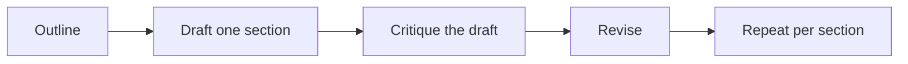

# Using LLMs Effectively

A practical guide

<div class="pt-12 text-sm opacity-70">
Harrison Schwarzer
</div>

<!--
Welcome! Presenter notes go in HTML comments like this one.
Press `o` for overview, `space` to advance. Presenter mode: add /presenter to the URL.
-->

---

# Agenda

1. **How LLMs work** — the 60-second mental model
2. **Prompting fundamentals** — context, specificity, format
3. **Working style** — iterate, decompose, verify
4. **Failure modes** — and how to catch them
5. **Beyond chat** — tools and agents

---

# How LLMs Work, in One Slide

- The model predicts the next **token** (~¾ of a word) given everything before it
- Everything it "knows" about your task lives in the **context window** — what you paste in, plus its training
- Training data has a **cutoff date** — recent events and APIs may be missing or stale
- Output is **sampled**, not retrieved — the same question can get different answers

<div class="mt-8 p-4 bg-amber-500 bg-opacity-10 rounded">
💡 Consequence: the quality of the answer is bounded by the quality of the context you provide.
</div>

---

# Prompting Fundamental #1: Be Specific

The model can't read your mind — vague in, vague out.

<div class="grid grid-cols-2 gap-4 mt-4">
<div class="p-4 bg-red-500 bg-opacity-10 rounded">

**❌ Vague**

> "Make this email better."

</div>
<div class="p-4 bg-green-500 bg-opacity-10 rounded">

**✅ Specific**

> "Rewrite this email to be under 100 words, friendly but direct, and end with a clear ask for a meeting next week."

</div>
</div>

State the **audience**, the **constraints**, and what **done** looks like.

---

# Prompting Fundamental #2: Give Context

The model only knows what's in the conversation.

- Paste the relevant code, doc, or data — don't just describe it
- Say what you already tried and what happened
- Explain the *purpose*, not just the task ("this is for a 5-minute standup update")
- For recurring work, keep a reusable preamble: who you are, house style, conventions

<div class="mt-6 p-4 bg-amber-500 bg-opacity-10 rounded">
💡 A good prompt often looks like a good bug report or a good brief to a contractor.
</div>

---

# Prompting Fundamental #3: State the Output Format

Don't make the model guess what shape you want.

```text
Summarize the attached customer interviews.

Output format:
- One markdown table: | Theme | # of mentions | Representative quote |
- Max 6 themes, sorted by frequency
- After the table, 3 bullet points of recommended next steps
```

Works for structure (tables, JSON, bullet limits), tone, length, and language.

---

# Show, Don't Tell: Few-Shot Examples

One or two examples beat a paragraph of instructions.

```text
Convert feature requests into user stories. Examples:

Request: "Let me export my data"
Story: As a user, I want to export my data as CSV,
       so that I can analyze it in my own tools.

Request: "Dark mode plz"
Story: As a user, I want a dark color theme,
       so that I can work comfortably at night.

Request: "Search is slow when I have lots of documents"
Story:
```

The model infers the pattern — format, tone, level of detail — from your examples.

---

# Treat the First Answer as a Draft

The first response is the *start* of the work, not the end.

- **Push back**: "shorter", "more formal", "you ignored the constraint about X"
- **Ask for variants**: "give me 3 different approaches and their trade-offs"
- **Make it critique itself**: "what's weakest about this answer?"
- If the conversation drifts, **start fresh** with a better prompt — don't rescue a bad thread

<div class="mt-6 p-4 bg-amber-500 bg-opacity-10 rounded">
💡 Iterating in conversation is cheap. Use it.
</div>

---

# Decompose Big Tasks

"Write my thesis" fails. A pipeline of small steps succeeds.



- Each step gets its own focused prompt and its own review
- You catch errors early, before they compound
- Small steps also fit better in the context window

---

# Give the Model Room to Reason

For anything with logic — math, planning, tricky edge cases:

- Ask it to **think step by step before answering**
- Ask for the **plan first**, then approve it before execution
- For high-stakes answers, ask the same question **two different ways** and compare

<div class="grid grid-cols-2 gap-4 mt-4">
<div class="p-4 bg-red-500 bg-opacity-10 rounded">

**❌** "What's the right answer? Just the number."

</div>
<div class="p-4 bg-green-500 bg-opacity-10 rounded">

**✅** "Work through this step by step, then state the final answer."

</div>
</div>

---

# Know the Failure Modes

| Failure mode | What it looks like | Defense |
|---|---|---|
| **Hallucination** | Confident, plausible, wrong — fake citations, invented APIs | Verify anything you'd be embarrassed to repeat |
| **Sycophancy** | Agrees with your framing even when you're wrong | Ask it to argue *against* you |
| **Stale knowledge** | Outdated libraries, old prices, pre-cutoff events | Provide current docs; ask it to flag uncertainty |
| **Lost in the middle** | Ignores details buried in long context | Put key instructions at the start or end |

---

# Verify Before You Ship

Never forward LLM output you haven't reviewed.

- **Code**: run it. Run the tests. Read the diff like a code review.
- **Facts & citations**: spot-check against primary sources.
- **Numbers**: recompute at least one yourself.
- Calibrate effort to stakes: a brainstorm needs no audit; an email to your CEO does.

<div class="mt-6 p-4 bg-amber-500 bg-opacity-10 rounded">
💡 You own the output. "The AI wrote it" is not a defense.
</div>

---

# Beyond Chat: Tools and Agents

Modern LLMs don't just answer — they can **act**: search, run code, edit files, call APIs.

```python
import anthropic

client = anthropic.Anthropic()
response = client.messages.create(
    model="claude-fable-5",
    max_tokens=1024,
    tools=[{"name": "run_tests", "description": "Run the project test suite", ...}],
    messages=[{"role": "user",
               "content": "Fix the failing test in auth.py and verify the fix."}],
)
```

- Agents loop: **plan → act → observe → repeat** — great for multi-step work
- The same rules apply, amplified: clear goals, good context, verification at the end

---

# Key Takeaways

1. **Context is everything** — the model only knows what you give it
2. **Be specific** — audience, constraints, output format
3. **Show examples** — few-shot beats long instructions
4. **Iterate and decompose** — drafts and small steps, not one-shot magic
5. **Verify** — you own the output, so check it before it ships

---
layout: center
class: text-center
---

# Questions?

<div class="mt-4 text-sm opacity-60">
© 2026 Harrison Schwarzer · Content CC BY 4.0 · Code MIT
</div>
